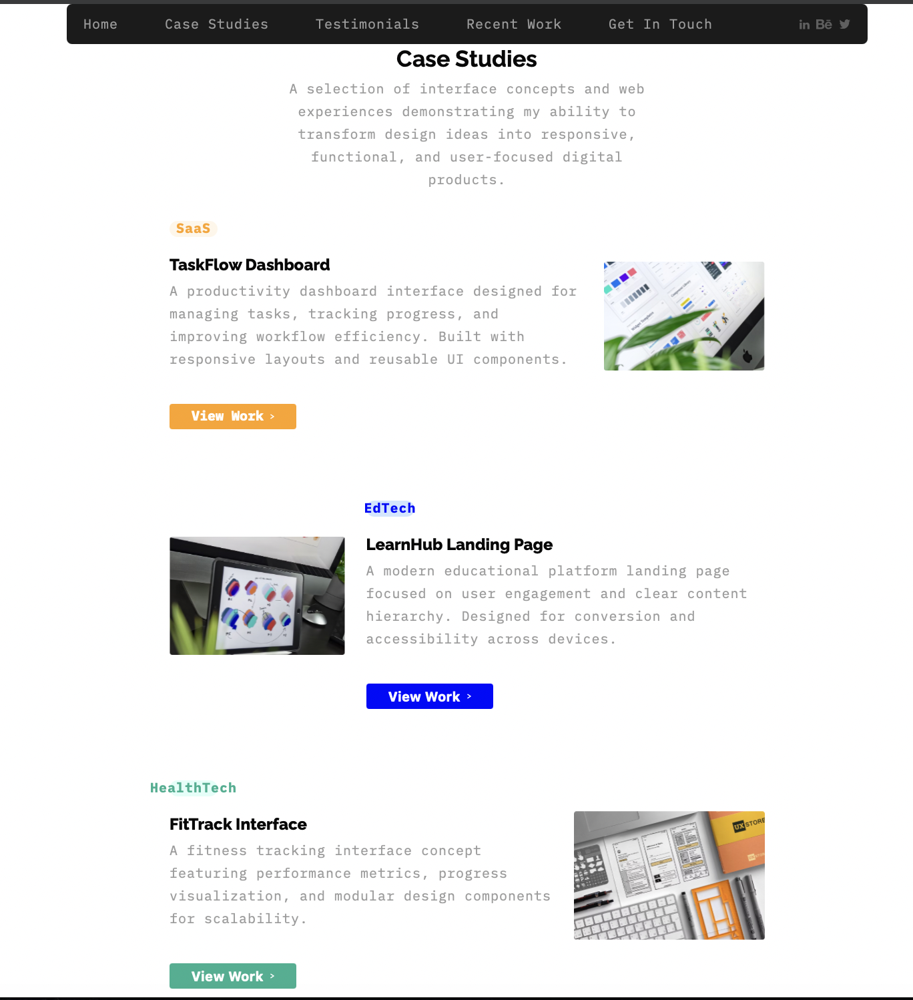
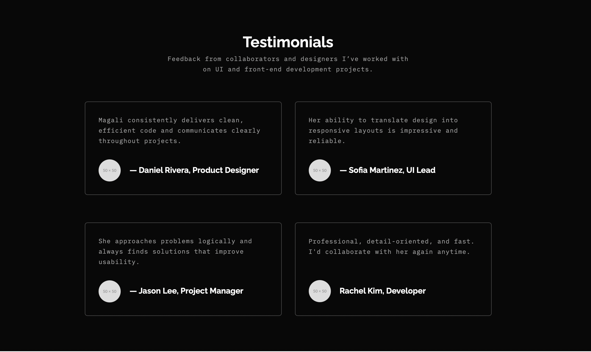
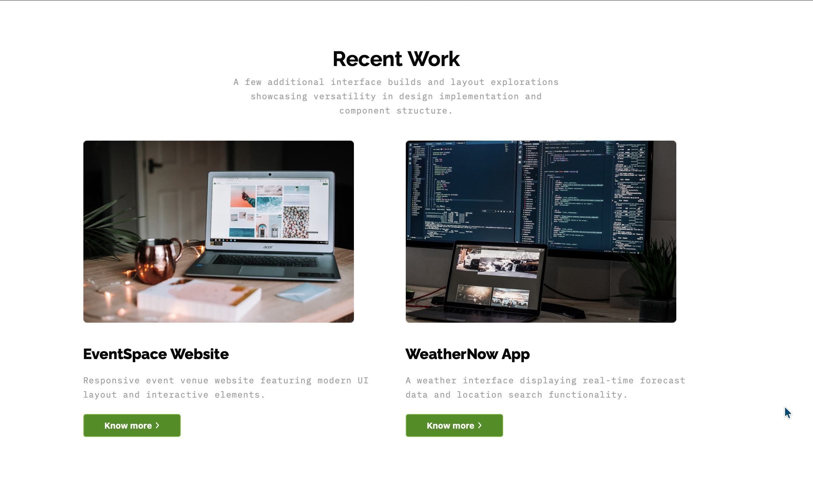

# figma-porfolio_magali

HTML/CSS final assignment - Figma Design Mockup

# 🌐 Figma Portfolio Landing Page

## Author

**Magali Bogarin**  
GitHub: https://github.com/mbogarin

## 📑 Table of Contents

- [Project Description](#project-description)
- [Features](#features)
- [Installation](#installation)
- [Usage](#usage)
- [Screenshots](#screenshots)
- [Roadmap](#roadmap)
- [Collaborators](#collaborators)
- [Project Structure](#project-structure)
- [Notes](#notes)

## Project Description

This project is a personal front-end developer portfolio designed to showcase technical skills, UI implementation ability, and responsive design practices. The site was built by translating a detailed Figma design mockup into fully functional, responsive code, demonstrating the ability to accurately convert visual design specifications into clean, maintainable front-end architecture. It presents case studies, testimonials, recent work samples, and a contact form within a modern, structured layout.

Figma Design Link: https://www.figma.com/files/team/1606852370108648328/recents-and-sharing?fuid=1606852368142420890

## Features

- Pixel-accurate implementation from Figma design mockup
- Fully responsive layout for desktop, tablet, and mobile
- Semantic HTML5 structure for accessibility and SEO
- Modular, scalable CSS architecture
- Reusable UI components
- Fixed navigation bar with smooth scrolling
- Case study showcase section
- Testimonials section
- Recent work gallery
- Contact form UI
- Optimized images with lazy loading

## Installation

Before running this project, make sure you have:

1. Clone this repository

   ```bash
   git clone https://github.com/mbogarin/figma-portfolio_magali.git
   ```

2. Navigate into the project folder

   ```bash
   cd ./figma-portfolio_magali
   ```

3. Open `index.html` in your browser

No dependencies or build tools required.

## Usage

This site serves as a professional portfolio to:

- present projects
- demonstrate front-end development and UI implementation skills
- showcase ability to convert design mockups into production-ready code
- provide contact access for opportunities

Developers may also use it as a reference for structuring responsive layouts based on design prototypes.

## Screenshots

### Hero About Section


---

### Case Studies Section



---

### Testimonials Section



---

### Recent Work Section



---

### Contact Form


---

## Collaborators

Currently this project was developed independently.  
Future collaborators can be listed here.

Example format:

- Name — Role — GitHub Link
- Magali Bogarin - Developer - https://github.com/mbogarin

---

### Credits

- Classmates and mentors at coding temple

## Roadmap

- Planned improvements:
  - Add dark/light theme toggle
  - Add project filtering system
  - Animate UI elements on scroll
  - Integrate real contact form backend
  - Improve accessibility scoring
  - Add project detail pages

## Project Structure

```
project-root
│
├── index.html
├── styles.css
└── assets
```

## Notes

- Built from a Figma mockup to demonstrate real-world workflow skills
- Structured to reflect production-level front-end standards
- Designed with scalability in mind for future projects
- Emphasis on clean code, readability, and maintainability
- Uses clamp(), flexbox, and responsive techniques for adaptability across devices
- Demonstrates ability to translate UI design systems into code accurately

⸻

If you found this project helpful or inspiring, feel free to fork or reference it.
